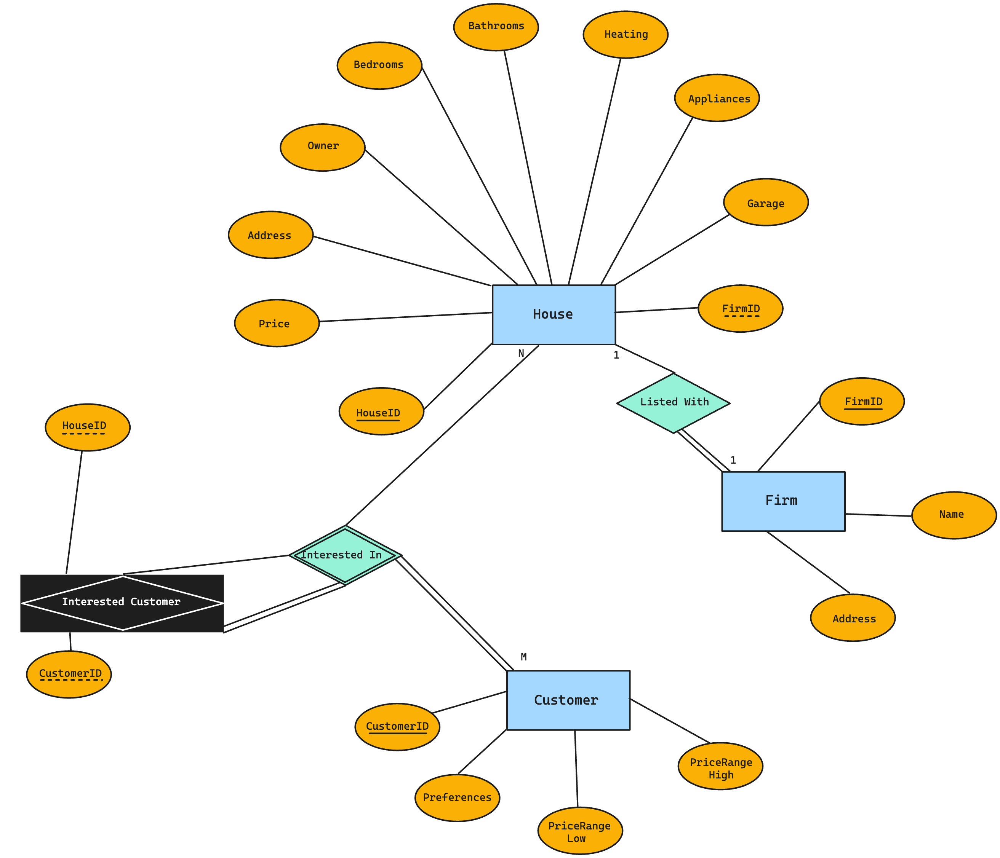

# Real Estate Database System

## Assumptions

* A house can only be listed with one firm at a time (exclusive listing).
* Customers can be interested in multiple houses, and houses can be of interest to multiple customers.
* The relationship between a house and a firm is optional since a house might not be listed with any firm.
* Each customer has a unique set of preferences that could match multiple houses.

## Requirements

* Data Integrity and Validation: 
  * Ensure that all foreign keys correctly reference existing records and that deletions or updates to referenced records are handled appropriately (e.g., cascading deletes for customer interests).
* Performance and Indexing: 
  * Indexes should be used on key attributes and foreign keys to enhance query performance, especially for large datasets.
* Security and Privacy: 
  * Sensitive data, such as customer preferences and personal information, should be protected according to data protection regulations.

* **Firm Data Requirements**
   * FirmID: A unique identifier for each firm.
   * Name: The name of the firm, which cannot be null.
   * Address: The physical address of the firm. This can be optional as not all firms may have a physical location accessible to the public.
* **House Data Requirements**
   * HouseID: A unique identifier for each house listed in the database.
   * Price: The listing price of the house. This is a required field and should be able to represent a wide range of values with precision for cents.
   * Address: The physical address of the house, which is required for identification and cannot be null.
   * Owner: The name of the house's owner. This is crucial for contact and legal purposes.
   * NumberOfBedrooms: An integer representing the number of bedrooms in the house. This can be optional as some listings may not provide this information.
   * NumberOfBathrooms: An integer representing the number of bathrooms in the house. This can also be optional.
   * TypeOfHeating: A description of the heating system installed in the house, which can be optional.
   * Appliances: A list or description of the appliances that come with the house, which can be optional.
   * SizeOfGarage: Describes the size or capacity of the garage, which can be optional.
   * FirmID (Foreign Key): Links a house to the firm it is listed with. This can be null if the house is not listed with any firm.
* **Customer Data Requirements**
  * CustomerID: A unique identifier for each customer using the system.
  * Preferences: A detailed description or list of the customer's preferences regarding house features (like bedrooms, bathrooms, etc.). This could be structured as a JSON object or a delimited text field.
  * PriceRangeLow and PriceRangeHigh: Numeric fields representing the customer's price range of interest. These fields define the minimum and maximum prices a customer is willing to consider.
* **CustomerInterest Data Requirements**
   * CustomerID (Foreign Key): Links to the Customer table to identify the customer with the interest.
   * HouseID (Foreign Key): Links to the House table to identify the house of interest.
   * The combination of CustomerID and HouseID should be unique to prevent duplicate entries of the same interest.

## Cardinality & Ratio

* **Listed With (between House and Firm)**
  * **Cardinality**: One-to-One (assuming exclusive listing) or One-to-Many (if a house can be listed with multiple firms, but for simplicity, we'll assume exclusive listings).
  * **Participation**: Partial on the House side (a house might not be listed with any firm) and Total on the Firm side (a firm exists to list houses).

* **Interested In (between Customer and House)**
  * **Cardinality**: Many-to-Many (a customer can be interested in many houses, and many customers can be interested in the same house).
  * **Participation**: Total on the Customer side (every customer is interested in at least one house) and Partial on the House side (a house might not interest any customer).

